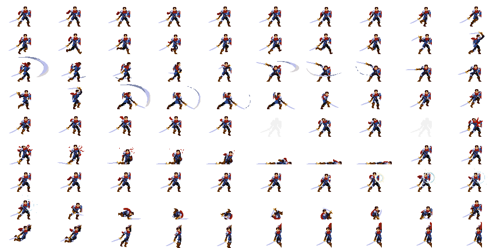

# NewInputSystem_WASD

유니티 버전 : 6000.0.57f1

Unity 2D 프로젝트에서 **새 인풋 시스템**으로 WASD 이동 + 점프, 그리고 **앞보기(look-ahead) 카메라**를 사용하는 간단 스타터입니다.

---

## 스크립트 설명 (짧게)

* **`PlayerController.cs`**

  * **Input System(Invoke Unity Events)** 로 입력을 받습니다.
  * `OnMove(Vector2)`에서 좌/우 값만 추출해 이동 방향을 캐싱하고, `OnJump()`에서 점프를 호출합니다.
  * 실제 물리 이동은 아래 `Movement2D`가 담당합니다.

* **`Movement2D.cs`**

  * `Rigidbody2D` 기반 **좌우 이동/점프** 로직.
  * `groundCheck`와 `groundLayer`로 **착지 여부**를 판단합니다.
  * 애니메이터 Bool 파라미터 **`isMove` / `isJump` / `isFall`** 를 현재 상태에 맞게 세팅합니다.

* **`Camera2DFollow.cs`**

  * 대상(플레이어)을 **부드럽게 추적**하면서, 이동 방향으로 **살짝 앞을 내다보는** 카메라.
  * `damping`, `lookAheadFactor`, `lookAheadMoveThreshold`, `lookAheadReturnSpeed`로 감도를 조절합니다.

---

## 인풋 액션 (예시)

* **Move**: *Value / Vector2*

  * 2D Vector Composite로 바인딩

    * Up/Down/Left/Right → `W/S/A/D` + 화살표
* **Jump**: *Button*

  * Keyboard `Space`, Gamepad `South` 등

> Player 오브젝트의 \*\*PlayerInput(Behavior: *Invoke Unity Events*)\*\*에서
> **Move → `PlayerController.OnMove`**, **Jump → `PlayerController.OnJump`** 로 연결하세요.

---

## 애니메이션 파라미터 & 재생 조건

사용 Bool 파라미터:

* `isMove` — 이동 중인지
* `isJump` — 공중에서 **상승 중**인지
* `isFall` — 공중에서 **하강 중**인지

권장 상태 & 전이 규칙:

| 상태(State) | 진입 조건                          | 종료/전이 조건                                                  |
| --------- | ------------------------------ | --------------------------------------------------------- |
| **Idle**  | `isMove == false` AND 착지 상태    | `isMove == true` → **Run**                                |
| **Run**   | `isMove == true` AND 착지 상태     | `isMove == false` → **Idle** / 점프 입력 후 공중으로 → **Jump**    |
| **Jump**  | 점프 직후, `isJump == true` (상승 중) | 수직속도 ↓ 되어 `isFall == true` → **Fall**                     |
| **Fall**  | 공중에서 `isFall == true` (하강 중)   | 착지(지면 감지) → `isJump=false`, `isFall=false` → **Idle/Run** |

세부 동작(스크립트 기준):

* **이동**: `Move()` 호출 시 `Rigidbody2D.velocity.x`를 갱신, 좌우 입력이 있으면 `isMove = true`, 없으면 `false`.
* **점프**: 지면일 때만 `Jump()`가 수직 속도 부여(`velocity.y = jumpForce`), 이때 상승으로 간주되어 `isJump = true`, `isFall = false`.
* **공중 판정**: 지면이 아닐 때 수직 속도 `vy`에 따라

  * `vy > 0` → `isJump = true`, `isFall = false`
  * `vy < 0` → `isJump = false`, `isFall = true`
* **착지 시**: `isJump = false`, `isFall = false` 로 리셋.

> 애니메이터에서는 `isMove`, `isJump`, `isFall` 세 Bool만으로 **Idle/Run/Jump/Fall** 전이를 구성하면 깔끔합니다. (Has Exit Time 해제 권장)

---

## 빠른 체크리스트

* Player 오브젝트

  * `Rigidbody2D`(Freeze Rotation Z 체크 추천), `Collider2D`
  * `Movement2D`에 `groundCheck`(발밑 빈 오브젝트)와 `groundLayer` 할당
  * `PlayerInput`(Invoke Unity Events) + 액션 연결
  * (선택) `Animator` 컨트롤러에 상태 4개(Idle/Run/Jump/Fall)와 Bool 파라미터 3개
* Main Camera

  * `Camera2DFollow` 추가, `target = Player`
